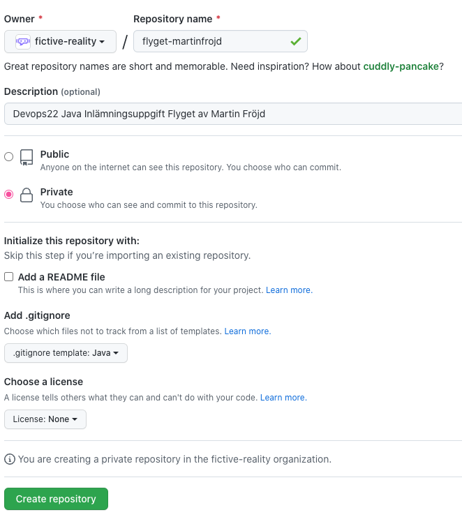

# Slutuppgift

Från lektion 9 och framåt arbetar ni på en individuell slutuppgift. Syftet är att kombinera det ni har lärt er under kursen och att ni kan visa att ni uppfyllt kraven i kursplanen.

## Detaljerade betygskrav för slutuppgift

Alla nedanstående krav bygger på vad som står i kursplanen men har förklarats i mer detalj här just för inlämningsuppgiften.

### Generella krav G

- Uppfylla alla krav listade under **Godkänd** nivå i din inlämningsuppgift
- Skriv all kod och kommentarer på engelska
- Använda sig av Git genom att skapa ett nytt repo, göra flera commits under utvecklingen och lämna in projektet via GitHub
- Projektet behöver vara uppsatt med Maven, ha en pom.xml fil och följa Mavens projektstruktur för kod- och testfiler.
- Skriva Java-kod med korrekt syntax och namngivning
- Strukturera en app korrekt i form av flertalet filer, klasser och metoder som alla har tydliga ansvarsområden (inte allt blandat eller på ett ställe) och som följer objektorienteringens principer
- Dokumentera publika klasser och metoder med Javadoc-kommentarer
- Använda sig av Javas standard-API, åtminstone Collections (List, Map eller Set).
- Använda sig av test-driven utveckling (TDD) och skriva minst 8 unit tester
- *Under seminarie* kunna visa att alla tester lyckas (är gröna)
- *Under seminarie* kunna använda debuggern för att visa hur en del av appen kör rad för rad
- *Under seminarie* kunna förklara alla delar av sin kod

### Generella krav VG
- Uppfylla *minst* två av de krav listade under **Väl godkänd** nivå i din inlämningsuppgift
- Korrekt använda sig av polymorfism och encapsulation, med hjälp av koncept som arv, interface, abstrakta metoder, getters/setters samt access som private/protected/public
- Inludera klassdiagram och/eller tillhandahålla annan design-dokumentation (DESIGN.md, etc)
- God förståelse av Git, inklusive användandet av branches under utveckling samt välformulerade commit-meddelanden
- Visa god förståelse för Javas API / bibliotek genom att använda flertalet av dem för att lösa problem (istället för att ex skriva egen kod för något som kan lösas av API)
- Skriva minst 16 unit tester som visar på en bred förståelse av olika principer för hur man kan testa samt som reflekterar de centrala kraven givna av designen
- *Under seminarie* kunna resonera runt designen och tester, vad som är inkluderat och exkluderat och andra sätt att lösa problemen på 

## Påbörja slutuppgift

Välj en slutuppgift från foldern `slutuppgifter/`. De liknar mycket uppgifterna i första Python-kursen, men läs dem noggrant för alla har ändrats något i kraven. Du bekräftar uppgiften du valt så här:

1. Starta ett nytt repository på GitHub (du vill förmodligen göra det privat så ingen annan ser). Döp det till [uppgiftens namn]-[ditt namn] (tänk på små bokstäver / tillåtna tecken för GitHub repository). Välj en gitignore-fil. Se bild för exempel 
2. Bjud in mig som collaborator.
3. Clona ner ditt repository till din dator och öppna det i VS Code.
4. **VIKTIGT** Det ska redan finnas en commit "Initial commit" och branchen ska heta "main". Skapa direkt en ny branch `submission` genom att skriva ex `git branch submission`, men byt inte till den. Den ska vara tom tills du är klar och ska göra din inlämning. Börja sedan koda på branch `main` (eller skapa egna feature branches som du mergar till main, om du vill).

## Genomföra slutuppgift

Du väljer själv hur du lägger upp arbetet, men här är några förslag:

- Börja med att sätta upp projektet med Maven. Titta i lesson_5 för tips.
- Börja med att designa din app, genom diagram och/eller att skriva ner något i DESIGN.md.
- Följ test-driven utveckling genom att tidigt skriva tester och välja ut de tester som bekräftar de viktigaste funktionerna appen ska ha, samt att skriva de klasser och metoder som är viktiga i designen. Följ processen lägg till test - röda tester - skriv kod tills grön - refaktorera koden.
- Utveckla iterativt, var beredd att ändra på din design under utvecklingens gång. Fokusera på att uppfylla de grundläggande kraven först.
- Om du fastnat, koda på en annan del av projektet en stund eller be om råd av mig eller en kamrat

## Inlämning

Denna gång gör vi inlämning via GitHub. Gör så här:

- När du känner dig klar med din huvudbranch (normalt `main`), ta bort filer som inte ska vara med och testa så det fungerar som det ska.
- Kontrollera att du har en branch `submission` som du skapade i början. Den ska bara ha en commit, "Initial commit". Se till att den också är pushad och syns på Github. (om du glömde göra en branch submission kan du [fortfarande göra en nu](https://stackoverflow.com/questions/2816715/branch-from-a-previous-commit-using-git) genom att utgå från den första committen)
- På GitHub, skapa ett Pull Request från din `main` till din `submission`. Du kan göra det genom att gå till Pull Requests i repot, välja "New pull request". I sidhuvudet under "Compare changes", sätt "compare: main" och välj "base" till "submission". Det finns även andra sätt du kan göra en PR från main till submission på.
- När du skapat PR:en, sätt mig som Reviewer. Jag behöver vara collaborator redan för att det ska gå.
- Kontrollera att PR:en bara innehåller saker du vill ha med i din submission. Om du behöver ta bort något är det enklaste att göra en ny commit som tar bort det som inte ska vara där.
- Om du kommer på att du behöver göra fler ändringar innan deadline behöver du INTE gör en ny PR. Pusha bara fler commits till din branch (ex main) så uppdateras PR automatiskt.
- Merga eller stäng INTE din PR. Jag stänger PR:en med kommentarer när jag gjort klart betygsättningen.